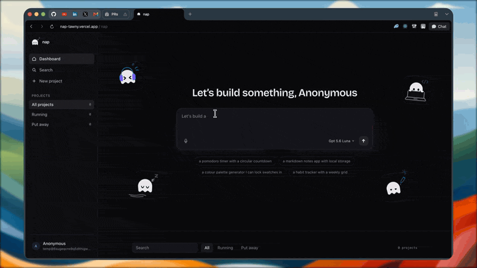

# Nap

[](https://github.com/mangit955/nap/actions/workflows/ci.yml)

**Describe an app. Then go take a nap.**

Most AI builders assume you sit and watch. Nap assumes you leave.

You describe an app, an agent builds it in a machine of its own, and it keeps its head while you
don't: the sandbox is committed and snapshotted when you stop paying attention, the transcript is a
durable event log rather than a spinner, and reopening the tab puts you back exactly where you dozed
off.

That premise is not a tagline bolted onto a demo — it is what the architecture is for. Walking away
from a half-built app is only reasonable if the work survives your absence, the machine stops
costing money while you're gone, and the story of what happened is still there when you return.
Most of the engineering below exists to make those three things true.

> **Status:** v1, complete and deployed — **[nap-tawny.vercel.app](https://nap-tawny.vercel.app)**.
> No account needed: there is a demo door, and turns run on a free-tier model under tight
> ceilings. **Use Chrome or Firefox** — the app and its API are on two different sites, so the
> session cookie is third-party, and Safari and Brave block those outright. Running it yourself
> is [below](#running-it); deploying your own is [docs/DEPLOY.md](docs/DEPLOY.md).

<!--
  DEMO GOES HERE. Record ~20s at 1280×800: type "a todo list with add, complete and delete"
  into the composer, let the tool calls stream in the transcript, and stop once the preview
  goes live. Save as docs/demo.gif and replace this comment with:
  

  It has a second home: apps/web/src/docs/how-nap-works.tsx opens with the same recording and
  carries the same note. One recording, both holes — fill them together or they will drift.
-->

---

## What it does while you're gone

- **It puts your project away and brings it back.** A sandbox is billed by the second and does not
  survive being idle, so an untouched project is committed, bundled and snapshotted to object
  storage, then destroyed. Your next message restores it — files and git history intact. Leaving
  costs nothing.
- **You can rejoin the story at any point.** The transcript is a durable, ordered event log, not a
  view of a live socket. Close the tab mid-turn, lose your connection, come back in an hour — the
  client asks for everything after the last event it saw and gets exactly the gap, with no
  duplicates and no holes.
- **Stopping is safe.** Cancel a turn mid-thought: what the agent finished is kept and the sandbox
  is left consistent, rather than half-written and unclear.
- **Ceilings on everything that costs money**, because an unattended agent with an open-ended budget
  is a bill with no ceiling. Per-user turn rate limits, per-user and process-wide sandbox quotas, a
  token budget per turn, and a step budget per agent loop.

And while you're watching:

- **A prompt becomes a running app.** The agent plans, writes files into a fresh sandbox, runs
  commands, and a Vite dev server serves the result behind a preview URL.
- **Every step is visible as it happens** — tool calls, file diffs and command output stream to the
  browser over a WebSocket while the agent works.
- **Iterative edits.** "Make it dark mode with a purple accent" edits the project in place and lands
  through HMR without a reload.
- **A read-only file tree**, showing everything the agent wrote, with the files it touched this
  session marked.
- **Bring your own key.** Sign in with email, GitHub or Google — or with no account at all. A saved
  key unlocks the paid models and bills turns to you; without one you get the free tier under lower
  ceilings.

## Architecture

```
Browser (Next.js)                         ← Presentation Plane
   │ HTTPS + WebSocket
API server (Hono on Bun)                  ← API Gateway/BFF + Session Service + Streaming Hub
   │
   └── Runtime  (turn orchestration)      ← Intelligence Plane
         ├── ContextEngine ──► MemoryProvider (no-op in v1)
         ├── AgentService  ──► LLMProvider
         ├── SandboxManager ──────────────► E2B sandbox   ← Execution / Control Plane
         ├── EventStore (Postgres)                          /workspace (git repo)
         └── EventBus (in-process)                          vite dev :5173 → preview URL
```

A thin vertical slice through all five planes. Each component owns one thing, and the boundaries are
the point: `Runtime` owns the turn lifecycle and never owns prompt content; `ContextEngine` owns the
token budget and never calls the model; `AgentService` drives one turn's model loop and never
touches persistence or git; `SandboxManager` knows nothing about agents or turns; `EventStore`
appends before `EventBus` fans out. The dependency direction between packages is enforced by
`test/architecture.ts` rather than by discipline, at both the manifest and the import.

**The full table — every component, what it owns and what it must never do — is on the
[docs page](https://nap-tawny.vercel.app/docs#architecture), with the package graph beside it.**

## Decisions worth defending

**Durable append, then fanout — in that order.** This is the one that makes leaving work. A turn's
events are written to Postgres with a monotonic `seq` *before* they are published to subscribers.
Publishing first is faster, and it means a client can see an event that a crash then loses — after
which the browser and the database disagree and nothing can say which is right. Because the order is
fixed, catching up is a single question: everything after `seq`. A reconnect an hour later is the
same operation as a reconnect a second later.

**A completed turn is a claim, not a fact.** A model announcing it is finished is evidence, not a
finding, so a turn that changed files is committed and then checked against the project's own
checks — discovered from the project rather than declared by the agent. Passing makes that commit a
*checkpoint*; failing opens a repair turn carrying the failure, which is an ordinary turn and so
inherits budgets, cancellation and event ordering without any of them being rebuilt. A failed
verification cannot corrupt the last known-good state, by construction rather than by care.
[The loop in full →](https://nap-tawny.vercel.app/docs#verification)

**A job outlives the turn that started it, and has no table behind it.** What was asked, how far it
has got and what has been verified are a fold over the session's events — the same events the
transcript is folded from — so there is one source of truth and resuming is replaying. A trivial
request is a job that opens and closes in one turn; a large one spans six, with nothing having had
to decide in advance which it was.
[Phases and bounds →](https://nap-tawny.vercel.app/docs#durable-jobs)

**An idle project is snapshotted, not paused.** Keeping a sandbox alive so a project stays openable
means paying for a machine nobody is using — so the reaper commits the workspace, bundles the git
repository to R2 and destroys the sandbox. Restore is the inverse. That turns "come back tomorrow"
from a billing problem into a cold start, and it is why the snapshot and its bookkeeping are
separate ports: the bytes and the rows fail independently, and teardown ordering is only expressible
if they do.

**No agent harness, and the six tools are the reason.** A batteries-included agent SDK ships built-in
`Read`/`Write`/`Edit`/`Bash` — and those act on the filesystem of the process running the harness,
which here is the API server, not the user's sandbox. So `AgentService` drives the model loop itself
over an `LLMProvider` port, and the only tools that exist are the six in
[`packages/agent/src/tools/`](packages/agent/src/tools) — `read_file`, `write_file`, `edit_file`,
`list_files`, `search_files`, `run_command` — each proxying to `SandboxManager`. That is stronger
than disabling built-ins, because there is no toggle to get wrong. It is also what makes an
unattended agent something you can walk away from: there is no reachable filesystem but its own.

**The dependency direction is enforced by a test, not by discipline.**
`runtime → {context, agent, sandbox, storage, capture, db, verify} → shared`, checked in
`test/architecture.ts`. Adding an import that violates it fails `bun run test`; adding a new
workspace package fails the test until you declare its rule. `agent` imports the `SandboxManager`
*interface* and never the E2B adapter, which is what makes swapping E2B for Kubernetes a
one-package change rather than an audit.

**Another user's project answers 404, not 403.** A 403 confirms the row exists, which is itself a
fact about someone else's data — it makes "not yours" distinguishable from "never existed". The
authorization filter lives in the query rather than in a handler that might forget it: every store
method takes a user id.

**Keys are sealed, and never readable back.** A key someone brings is encrypted with a
per-deployment secret before it is stored, and no endpoint will return it — not on read, not as an
echo after save, not in an error. What you get back is `sk-or-…4f2a`: enough to recognise your own
key, useless to anyone who has stolen a session. Keys are verified against the vendor before being
accepted, so a typo fails on the screen where it was made rather than three layers away as "the
model is unavailable".

**Failures are typed results; exceptions are for bugs.** A sandbox that cannot be acquired, a budget
that runs out, a key a vendor refuses — expected outcomes with their own shapes, not thrown errors.
Rate limiting answers **429** with `Retry-After` because it is a speed problem; a sandbox quota
answers **409** because it is a state conflict and the fix is closing a project, not waiting.

## Running it

**Prerequisites:** [Bun](https://bun.sh) · Docker (for Postgres and the `db` test suite) ·
an [E2B](https://e2b.dev) key · an [OpenRouter](https://openrouter.ai/keys) key ·
a [Cloudflare R2](https://developers.cloudflare.com/r2/) bucket.

```bash
bun install
docker compose -f infra/docker-compose.yml up -d   # Postgres
cp apps/api/.env.example apps/api/.env             # then fill it in
bun run db:migrate
bun run dev                                        # web on :3000, api on :3001
```

`apps/api/.env.example` documents every variable and why it exists. Five are required and the API
refuses to boot without them, naming every problem at once rather than one per restart:

| Variable | What it is |
|---|---|
| `DATABASE_URL` | Matches `infra/docker-compose.yml` as shipped |
| `E2B_API_KEY` | The sandboxes a turn runs in |
| `OPENROUTER_API_KEY` | Which account pays for the model |
| `BETTER_AUTH_SECRET` | Signs session cookies — `openssl rand -base64 32` |
| `NAP_KEY_ENCRYPTION_SECRET` | Seals stored API keys — `openssl rand -base64 32`, must decode to exactly 32 bytes |

Plus `R2_ACCOUNT_ID`, `R2_BUCKET`, `R2_ACCESS_KEY_ID` and `R2_SECRET_ACCESS_KEY`: a server that can
destroy sandboxes but has nowhere to snapshot them is worse than one that does neither.

GitHub and Google sign-in are optional, but each pair is both-or-neither — boot refuses one on its
own, because half an OAuth app fails at the redirect back rather than at startup. Without them,
email sign-in still works.

### The free path

Most of this codebase can be exercised without spending anything or holding any credential:

```bash
bun run harness "build a todo list"   # a whole turn against fakes — no network, no spend
bun run test:fast                     # unit + type suites; no Docker, no credentials
bun run ws:smoke                      # drives /ws over a real socket, no database
```

Every external dependency sits behind a port with a production-quality fake in
`packages/*/src/testing/`, which is what makes that possible. Add `--real` to the harness to run the
same turn against a real sandbox and a real model — that one spends money.

## Testing

```bash
bun run test          # unit + type + web + db — deterministic, free, needs Docker
bun run test:fast     # the Docker-free inner loop
bun run typecheck     # per-workspace tsc, then a root pass
bun run lint          # biome
```

**2243 tests across 173 files.** Four suites, split by the *environment* each needs rather than for
tidiness: node, `tsc` (compile-time type assertions), jsdom, and a throwaway Postgres container
started per run. The filename decides which suite collects a test, so all four can sit side by side
in one package.

Two rules that earned their place. **Never assert on model prose** — assert on tool-call sequences,
event types and ordering, and filesystem effects, which are the things that are actually
contractual. And **anything that guards must be seen to fail**: a check nobody has watched break is
not known to work, it may be silently passing on everything.

> ⚠️ Always `bun run test`, never `bun test` — `test` is a Bun built-in that shadows the
> package.json script and runs Bun's own runner over Vitest files, reporting nonsense.

The same three gates run on pre-commit and in CI on every push.

## Layout

```
packages/  shared  db  sandbox  storage  capture  agent  context  runtime  verify  bench
apps/      web (Next.js)   api (Hono, on Bun)   napbench (the benchmark CLI)
```

Bun is the package manager, script runner and the API's runtime. Vitest stays the test runner —
`bun test` has no named projects, no `--changed`, and no type-test mode, all three of which this
repo needs.

## Where it stands

Milestones M0–M5 are built: contracts and scaffold, the execution plane, the agent loop, streaming
and presentation, persistence, and auth with hardening. One task remains before v1 is called done.

The bigger features are deliberately absent — but each has its seam already in place, which is a
different claim from a roadmap:

| Not built | Seam that exists today |
|---|---|
| Kubernetes sandbox pods | `SandboxManager`, plus a conformance suite any implementation must pass |
| Redis Streams event bus | `EventBus` |
| Long-term memory | `MemoryProvider`, with real call sites in `ContextEngine` |
| Multi-agent | `Runtime` — fan out to several `AgentService` runs, join their event streams |
| Billing and quotas | Per-turn usage already accumulated by `LLMProvider` |
| Monaco editing, terminal | The file tree already reads from the sandbox filesystem |

## More

- **[The docs page](https://nap-tawny.vercel.app/docs)** — how it works and why it is built this
  way, at length: the event model, durable jobs, verification and repair, sandboxes and snapshots,
  and how the agent is measured. This README states the consequences; that states the mechanisms.
- [`docs/PLAN.md`](docs/PLAN.md) — the v1 spec, locked decisions and full task list
- [`docs/GOTCHAS.md`](docs/GOTCHAS.md) — the hard-won constraints, grouped by area, each one written
  down because it cost a session
- [`CLAUDE.md`](CLAUDE.md) — how to work in this repo: commands, conventions, the definition of done
